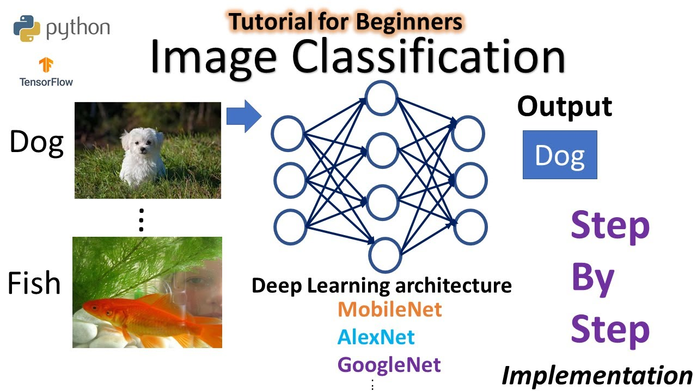
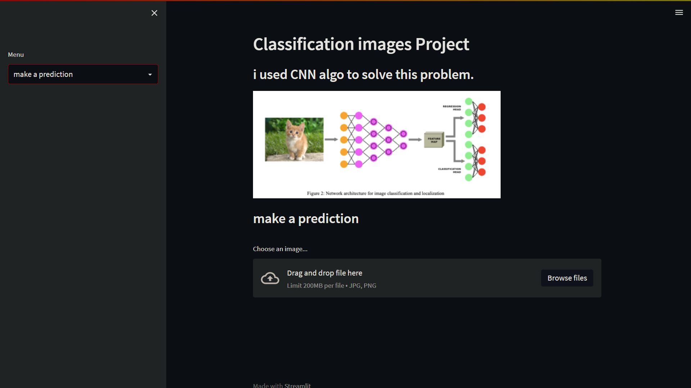

# Image-Classification-using-CNN

### Image Classification is a fundamental task that attempts to comprehend an entire image as a whole. The goal is to classify the image by assigning it to a specific label

### How to run:

#### 1. clone all files
#### 2. open streamlit_app_main.py file
#### 3. in terminal , type 'run streamlit streamlit_app_main.py' script
#### 4. a web will be appearing on web browser

#### 5. load your pictures and waiting

## note: model classify whether is lion or tiger!
